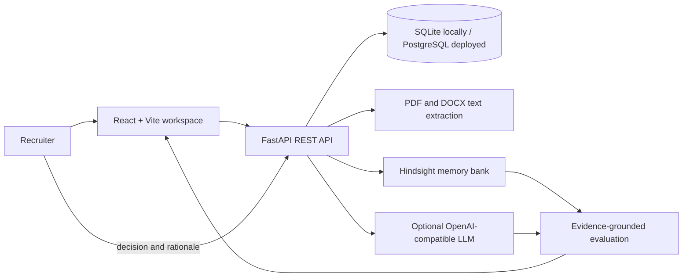

# RecruitMind

**RecruitMind is a recruiter-led hiring workspace where past hiring feedback can inform future candidate reviews.** It uses [Hindsight](https://hindsight.vectorize.io/) as persistent memory: recruiters record a decision and role-related rationale, and the system recalls relevant team experience during later evaluations.

RecruitMind is decision support, not an automated hiring system. A recruiter reviews the resume evidence and makes every hiring decision.

## The problem

Recruiting teams repeatedly assess similar skills and roles, but their reasoning is often scattered across notes and past decisions. A new review can lack useful context about what the team learned from earlier candidates.

RecruitMind connects each review to explicit recruiter feedback over time. Its goal is to make relevant experience available when the next candidate is evaluated, while keeping the current resume evidence visible and in control.

## How it works

1. Create or select a role and its required skills.
2. Upload a PDF or DOCX resume. The backend extracts text and creates a candidate profile.
3. Evaluate the candidate. RecruitMind asks Hindsight for relevant prior hiring memories, then combines that context with role requirements and resume evidence.
4. Review the evidence, skills match, recommendation, and recalled memories in the workspace.
5. Record a recruiter decision and rationale. RecruitMind saves the decision locally and sends a concise, role-related memory to Hindsight for future recall.

The memory loop is the core workflow: **review → recruiter feedback → retain → recall in a later review**. Hindsight memories are historical context; they are not facts about the current candidate and must not override contradictory resume evidence.

## Key features

- Role and candidate workspace with create, view, and delete actions.
- PDF and DOCX resume text extraction, with a 10 MB upload limit.
- Candidate profile parsing and role-related evidence review.
- Optional structured evaluation through an OpenAI-compatible LLM API, including Groq.
- Transparent evidence-rules fallback when an LLM is not configured or cannot return a valid response.
- Hindsight memory recall before evaluation and memory retention after a recruiter decision.
- Memory Impact view to inspect recalled context separately from candidate evidence.
- SQLite for local setup; PostgreSQL can be configured for deployment.

## Architecture



### Stack

- **Frontend:** React, Vite, Axios
- **Backend:** Python, FastAPI, SQLAlchemy, Pydantic Settings
- **Database:** SQLite by default; PostgreSQL supported through `DATABASE_URL`
- **Memory:** Hindsight REST API for recall and retain
- **Model provider:** OpenAI-compatible chat completions API (for example, Groq)
- **Resume parsing:** `pypdf` and `python-docx`

## Run locally

### Requirements

- Python 3.10 or newer
- Node.js and npm
- Hindsight credentials for persistent memory (optional for trying the basic workflow)
- An OpenAI-compatible LLM API key and model ID for structured model evaluations (optional)

### 1. Configure the backend

From the repository root, create a local environment file:

```bash
cp .env.example .env
```

Set the provider values in `.env` if you want Hindsight memory and LLM evaluation:

```dotenv
DATABASE_URL=sqlite:///./recruitmind.db
HINDSIGHT_URL=https://api.hindsight.vectorize.io
HINDSIGHT_API_KEY=your_hindsight_api_key
HINDSIGHT_BANK_ID=your_exact_bank_id
LLM_BASE_URL=https://api.groq.com/openai/v1
LLM_API_KEY=your_groq_api_key
LLM_MODEL=your_active_groq_model_id
FRONTEND_URL=http://localhost:5173
```

Keep `.env` private. It is excluded from Git. If the Hindsight or LLM values are left blank, the corresponding feature is unavailable or uses the clearly labeled evidence-rules fallback.

### 2. Start the backend

**macOS / Linux**

```bash
cd backend
python3 -m venv .venv
source .venv/bin/activate
pip install -r requirements.txt
uvicorn app.main:app --reload
```

**Windows PowerShell**

```powershell
cd backend
py -m venv .venv
.venv\Scripts\Activate.ps1
py -m pip install -r requirements.txt
py -m uvicorn app.main:app --reload
```

The API runs at `http://localhost:8000`. Interactive API documentation is at `http://localhost:8000/docs`; the health endpoint is `http://localhost:8000/api/health`.

### 3. Start the frontend

Open a second terminal at the repository root.

```bash
cd frontend
npm install
npm run dev
```

Open the Vite URL shown in the terminal (usually `http://localhost:5173`). The frontend uses the local API at `http://localhost:8000/api` by default.

## Demo sign-in

The current sign-in screen is a **client-side demo gate**, not real authentication. Its demo credentials are:

```text
Username: recruiter
Password: password123
```

Do not treat this login as protection for a public deployment or use the app to store real candidate information until server-side authentication and access controls are implemented.

## Environment variables

| Variable | Purpose | Example / default |
|---|---|---|
| `DATABASE_URL` | SQLAlchemy database connection | `sqlite:///./recruitmind.db` locally; managed PostgreSQL in deployment |
| `HINDSIGHT_URL` | Hindsight API endpoint | `https://api.hindsight.vectorize.io` |
| `HINDSIGHT_API_KEY` | Hindsight credential | Set privately |
| `HINDSIGHT_BANK_ID` | Exact Hindsight bank ID | `recruitmind-team` in `.env.example` |
| `LLM_BASE_URL` | OpenAI-compatible API base | `https://api.groq.com/openai/v1` for Groq |
| `LLM_API_KEY` | LLM provider credential | Set privately |
| `LLM_MODEL` | Provider model ID | Choose an active model ID from your provider |
| `FRONTEND_URL` | Frontend origin allowed by backend CORS | `http://localhost:5173` |
| `VITE_API_URL` | Frontend API base URL | `/api` for the Vercel multi-service deployment; local default is `http://localhost:8000/api` |

## API overview

The API prefix is `/api`. Full interactive documentation is available at `/docs` while the backend is running.

| Method | Endpoint | Purpose |
|---|---|---|
| `GET` | `/api/health` | API and memory configuration status |
| `GET` | `/api/jobs` | List roles and candidate summaries |
| `POST` | `/api/jobs` | Create a role |
| `DELETE` | `/api/jobs/{job_id}` | Delete a role and its local candidate records |
| `POST` | `/api/jobs/{job_id}/candidates` | Upload and parse a PDF or DOCX resume |
| `POST` | `/api/candidates/{candidate_id}/evaluate` | Recall memory and evaluate candidate evidence |
| `POST` | `/api/candidates/{candidate_id}/decision` | Save recruiter decision and retain its rationale in Hindsight |
| `GET` | `/api/candidates/{candidate_id}` | Read a candidate profile and evaluation |
| `DELETE` | `/api/candidates/{candidate_id}` | Delete a candidate's local record |

## Hindsight memory details

Before evaluation, RecruitMind forms a recall query from the role title, required skills, and skills extracted from the resume. Returned memory is displayed separately and passed to the optional LLM evaluator as historical recruiter context.

After a recruiter chooses `shortlist`, `maybe`, or `reject`, the application saves the decision and rationale locally, then retains a concise decision event in the configured Hindsight bank. The retained event contains the role, decision, extracted skills, and recruiter rationale; it does not include resume text or contact details. If Hindsight is not configured, the UI reports that memory is unavailable. If an Hindsight operation fails, the API reports the failure rather than claiming it succeeded.

Learn more in the [Hindsight memory workflow](docs/hindsight-memory.md) and the official [Hindsight documentation](https://hindsight.vectorize.io/).

## Deployment

The repository includes a root-level [`vercel.json`](vercel.json) that configures the Vite frontend and FastAPI backend as Vercel services, routing `/api/...` to the backend. For Vercel, set `VITE_API_URL=/api` and configure backend credentials as environment variables. Use a managed PostgreSQL database for deployment rather than relying on the local SQLite file.

The current app has no server-side authentication or tenant isolation. Deploy only with synthetic/demo candidate data until those controls, secure operational practices, and a suitable privacy review are in place. See [deployment notes](docs/deployment.md).

## Limitations and responsible use

- The login is a fixed frontend demo check; it does not secure API endpoints.
- Candidate and role data are stored in the configured database. The original resume file is parsed in memory and is not retained as a binary upload; extracted resume text is stored in the candidate record.
- Scanned/image-only PDFs are not OCR-processed and may be rejected if no readable text is extracted.
- Schema creation currently uses SQLAlchemy `create_all`; database migrations are not configured.
- Do not use protected characteristics or infer them from resumes. Keep evaluations grounded in role-related evidence, and have a human recruiter review every recommendation.

## Live Deployment: https://lnkd.in/d3ZNaG35
## Medium technical article link: https://lnkd.in/dnZZmYGv
## Hindsight Github link: https://lnkd.in/dwFfmrUq
## Reddit article link: https://lnkd.in/dkaPNTrB
## Live demo link: https://drive.google.com/file/d/1Syi6G_U2mdy147Jcrz4k802Ohl3DBSeP/view?usp=drive_link

## Project documentation

- [Architecture](docs/architecture.md)
- [API reference](docs/api.md)
- [Hindsight memory workflow](docs/hindsight-memory.md)
- [Deployment notes](docs/deployment.md)
- [Demo script](docs/demo-script.md)

## License

No license is currently included. Contact the repository owner before reusing or redistributing this project.
